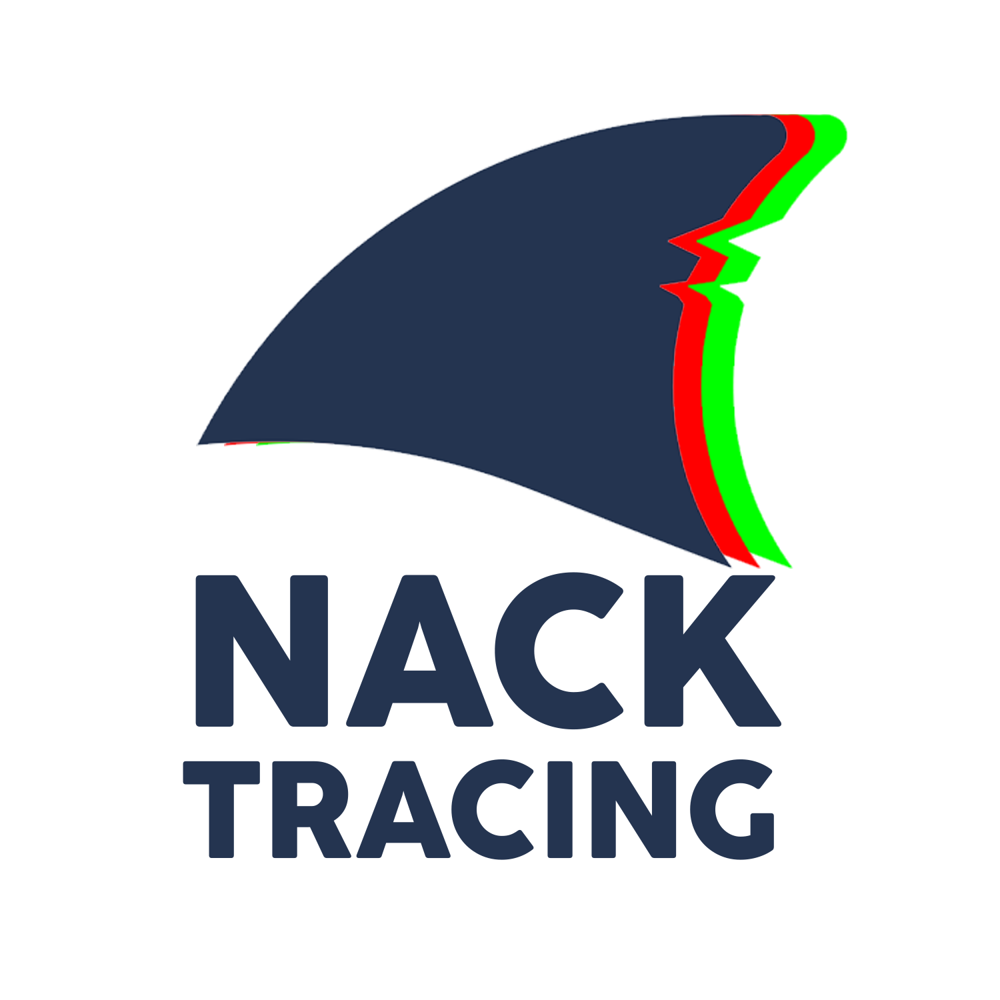

  

  <a href="README.es.md"> Español</a> | 
  <a href="README.md"> English</a>

# Nack Tracing: un motor de trazado de rayos fotorrealista en C#

Este proyecto, denominado Nack Tracing, es el Trabajo de Fin de Grado (TFG) de la Escuela de Ingeniería Informática de la Universidad de Oviedo. Consiste en el diseño y la implementación de un motor de trazado de rayos desde cero utilizando C# y la plataforma .NET.

El motor es capaz de generar imágenes sintéticas con un alto grado de realismo visual mediante la simulación del comportamiento físico de la luz al interactuar con diferentes materiales y geometrías en una escena 3D.

El proyecto persigue dos objetivos fundamentales: primero, construir una arquitectura de software robusta y escalable mediante la aplicación de patrones de diseño orientados a objetos, gestionando así la complejidad de la escena y facilitando su reutilización. Segundo, centrarse en la optimización del rendimiento, abordando el alto coste computacional inherente al trazado de rayos mediante mejoras tanto a nivel de algoritmo como de código para maximizar la eficiencia y reducir los tiempos de renderizado.

*Autor: Ignacio Fernández Suárez*

  

